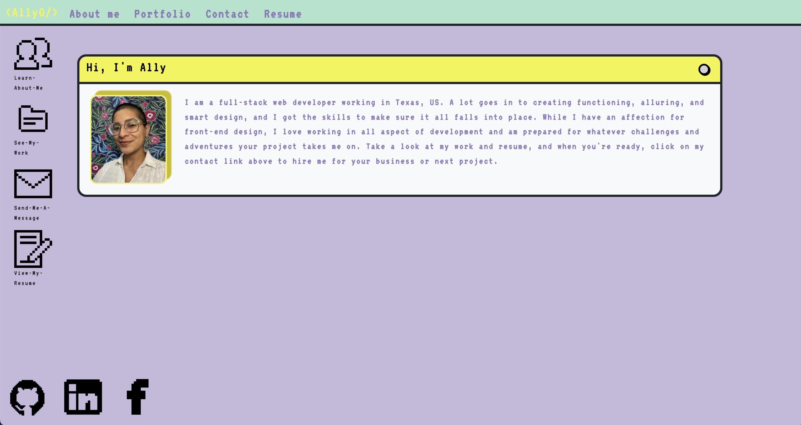
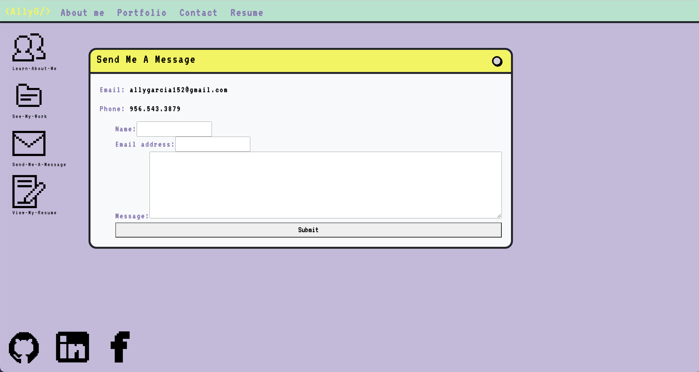
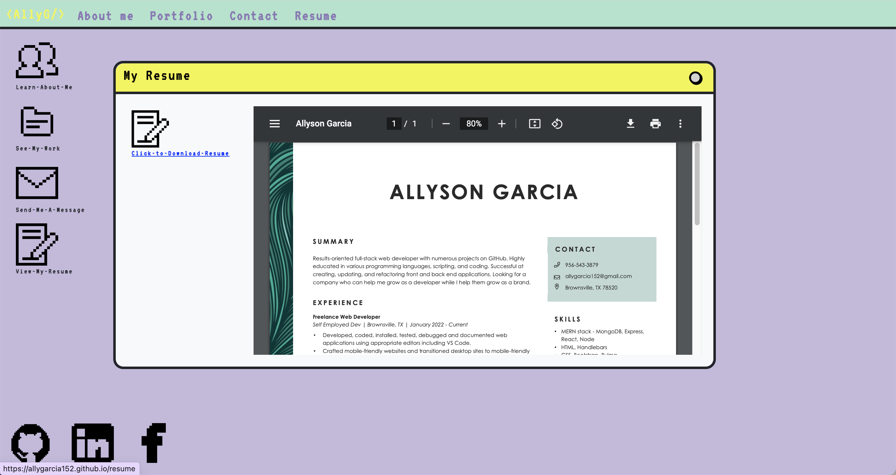
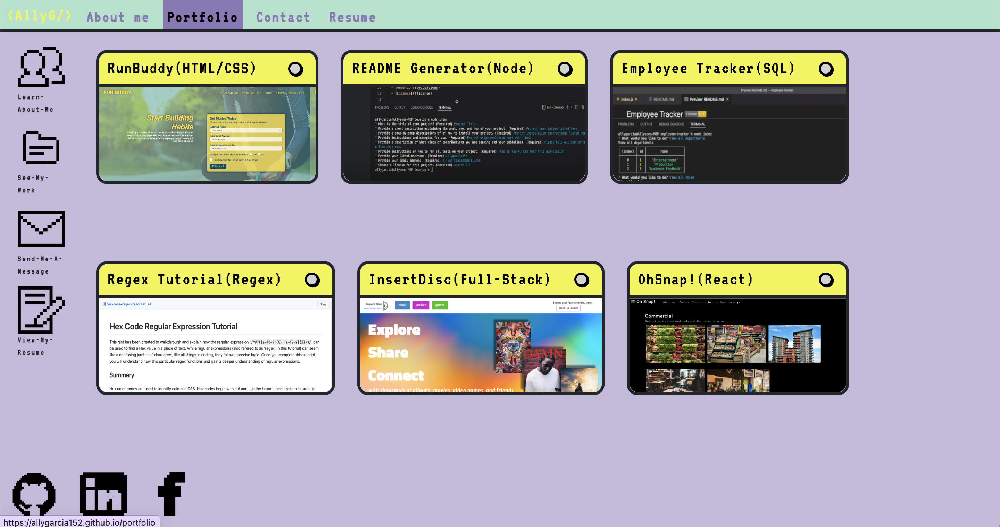

# Online Portfolio 

## Description

This online portfolio was created to showcase a web developer's information and work. This portfolio is designed to look like a 90's desktop, with the nav bar and desktop icons featuring pixelated text and images. The site includes an "About Me" section where a user can find information on the developer, a "Portfolio" section which displays six different projects showcasing a variety of talents and language proficiencies, a "Contact" section which has the developer's contact information as well as a form to submit a message, and a "Resume" section which both displays a resume as well as a link to download said resume.

View the repository here: [AllyG's online portfolio](https://allygarcia152.github.io/about)

## Table of Contents

- [Usage](#usage)
- [Updates](#updates)
- [Contributions](#contributions)
- [License](#license)

## Usage

In order to access each component of the portfolio, the user needs only to click on the respective links in the nav bar. The user can also click on the icons on the desktop as they are functional, not decorative. On the contact page, the user can enter in a message to send to the developer as long as they include their name and a valid email. 

On the Resume page, the user can click on the resume icon to download it, or simply view it in the pop-up window provided. 

On the Portfolio page, users can click on the text of the title of the project to see the GitHub repo, or click on the window body to see the deployed application if there is one.

## Contributions

The icons used for this website are from Flaticon and created by [Freepik](https://www.flaticon.com/). This project was bootstrapped with [Create React App](https://github.com/facebook/create-react-app). You can learn more in the [Create React App documentation](https://facebook.github.io/create-react-app/docs/getting-started). 

## Updates

This application does not necessarily follow DRY practices and will be refactored in the future. The application will also be updated to be more mobile-friendly.

## Liscense

This project is licensed under the MIT license. To abtain a copy of the license, visit: [https://choosealicense.com/licenses/mit](https://choosealicense.com/licenses/mit)

